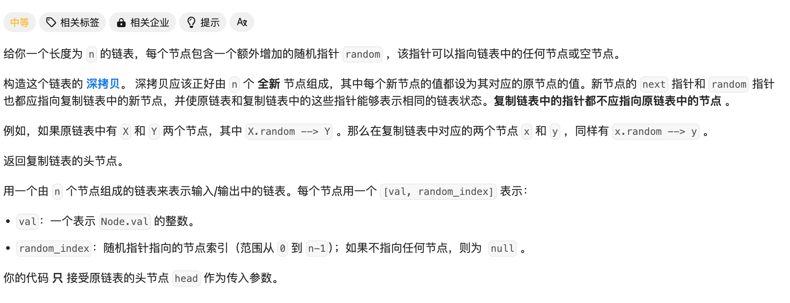
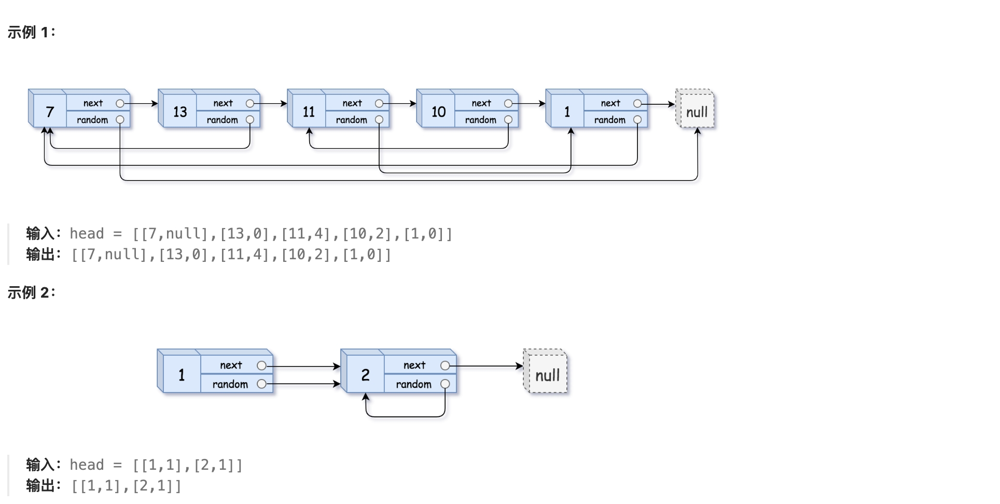
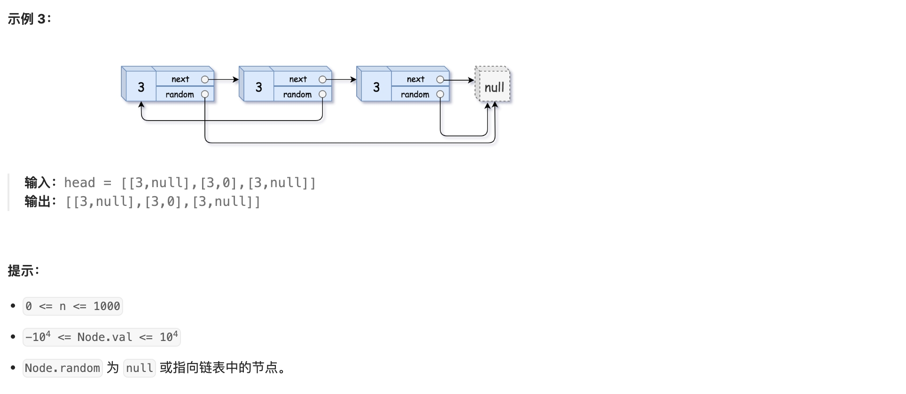

# [138. 随机链表的复制](https://leetcode.cn/problems/copy-list-with-random-pointer/)







简单的**模拟**题，直接模拟一遍复制操作即可。使用数组存储所有节点和random列表。

Code：

```cpp
/*
// Definition for a Node.
class Node {
public:
    int val;
    Node* next;
    Node* random;
    
    Node(int _val) {
        val = _val;
        next = NULL;
        random = NULL;
    }
};
*/

class Solution {
public:
    Node* copyRandomList(Node* head) {
        if(head==NULL) return NULL;
        //存储原链表中节点和索引的对应关系
        map<Node*,int> nodeMap;
        //存储深拷贝后的节点序列
        vector<Node*> newNodeList;
        //存储原数组random指向节点
        vector<Node*> originRandom;
        Node* tmp = head;
        int pos = 0;
        while(tmp!=NULL){
            nodeMap[tmp] = pos++;
            Node* newNode = new Node(tmp->val);
            originRandom.push_back(tmp->random);
            // newNode->val = tmp->val;
            newNodeList.push_back(newNode);
            tmp = tmp->next;
        }
        //开始处理next关系
        for(int i=0;i<newNodeList.size()-1;i++){
            newNodeList[i]->next = newNodeList[i+1];
        }
        //开始处理random关系
        for(int i=0;i<originRandom.size();i++){
            Node* rd_tmp = originRandom[i];
            if(rd_tmp==NULL) newNodeList[i]->random = NULL;
            else newNodeList[i]->random = newNodeList[nodeMap[rd_tmp]];
        }
        return newNodeList[0];
    }
};
```

