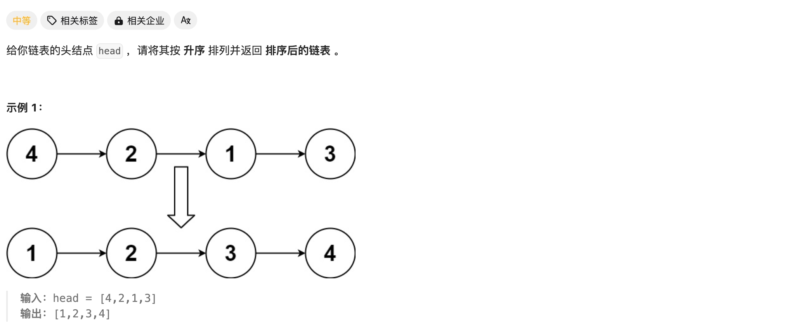
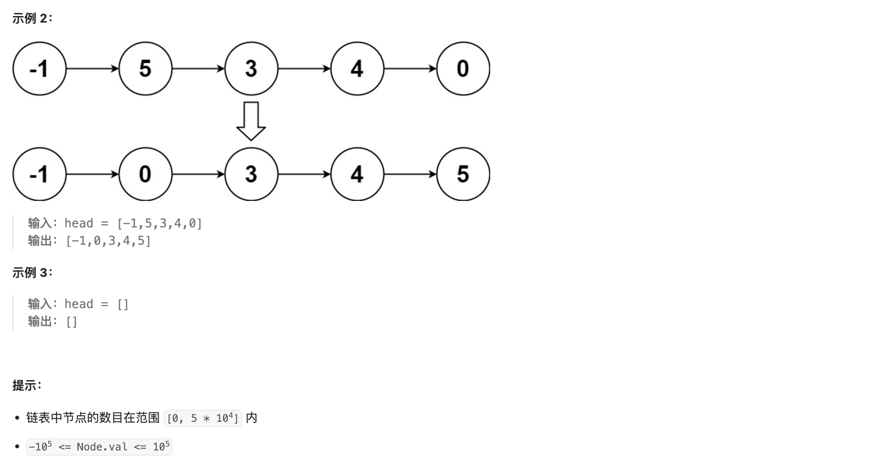

# [148. 排序链表](https://leetcode.cn/problems/sort-list/)





本人使用数组实现**存储后排序**，唯一需要注意的是排序后的链表末尾记得将最后一个节点的 `next` 改为 `NULL`。不然会导致力扣编译器报错 `heap-use-after-free on addres ...`

Code：

```cpp
/**
 * Definition for singly-linked list.
 * struct ListNode {
 *     int val;
 *     ListNode *next;
 *     ListNode() : val(0), next(nullptr) {}
 *     ListNode(int x) : val(x), next(nullptr) {}
 *     ListNode(int x, ListNode *next) : val(x), next(next) {}
 * };
 */
class Solution {
public:

    static bool cmp(ListNode* h1, ListNode* h2) {
        return h1->val < h2->val;
    }

    ListNode* sortList(ListNode* head) {
        if(head==NULL) return NULL;
        vector<ListNode*> lists;
        ListNode* tmp = head;
        while(tmp!=NULL){
            lists.push_back(tmp);
            tmp = tmp->next;
        }
        sort(lists.begin(),lists.end(),cmp);
        for(int i=0;i<lists.size()-1;i++){
            lists[i]->next = lists[i+1];
        }
        lists[lists.size()-1]->next = NULL;
        return lists[0];
    }
};
```

