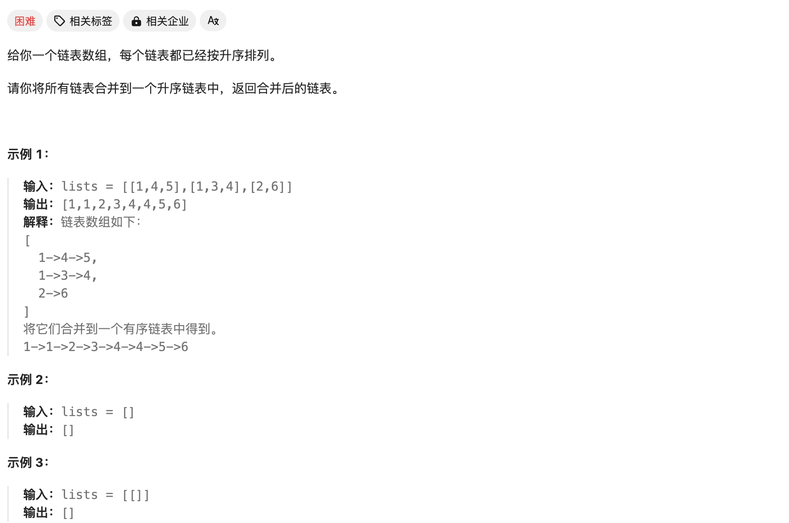
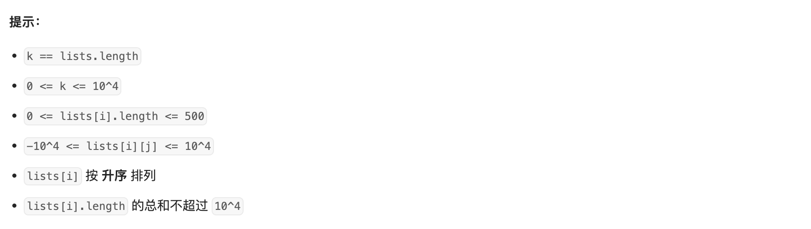

# [23. 合并 K 个升序链表](https://leetcode.cn/problems/merge-k-sorted-lists/)





转换为合并两个链表的问题——只需要存储**前一个合并的节**点，并判断两个链表头大小即可。

因此这里使用**优先队列**存储一遍所有链表的头，“用完”后继续存储下一趟。循环这个过程。

Code：

```cpp
/**
 * Definition for singly-linked list.
 * struct ListNode {
 *     int val;
 *     ListNode *next;
 *     ListNode() : val(0), next(nullptr) {}
 *     ListNode(int x) : val(x), next(nullptr) {}
 *     ListNode(int x, ListNode *next) : val(x), next(next) {}
 * };
 */
class Solution {
public:
    struct status {
        int val;
        ListNode *ptr;
        bool operator < (const status &rhs) const {
            return val > rhs.val;
        }
    };

    priority_queue <status> q;

    ListNode* mergeKLists(vector<ListNode*>& lists) {
        for (int i=0;i<lists.size();i++) {
            ListNode* node = lists[i];
            if (node){
                q.push({node->val, node});
            }
        }

        ListNode head, *tail = &head;

        while (!q.empty()) {
            auto tmp = q.top(); 
            q.pop();
            tail->next = tmp.ptr;
            tail = tail->next;
            if (tmp.ptr->next)
                q.push({tmp.ptr->next->val, tmp.ptr->next});
        }
        return head.next;
    }
};
```

