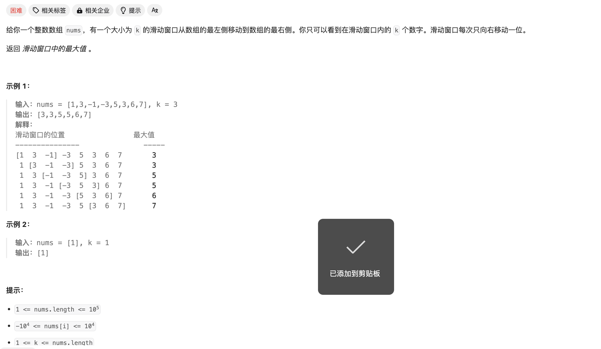

# [239. 滑动窗口最大值](https://leetcode.cn/problems/sliding-window-maximum/)




本题主要思路是维护**大根堆（优先队列）**。需要注意的是不需要每移动一次滑动窗口就将冗余元素移除，只需要判断每一次在堆顶的元素是不是在滑动窗口内即可：


Code：

```C++
class Solution {
public:
    int n;
    priority_queue<pair<int,int> > pq;

    vector<int> maxSlidingWindow(vector<int>& nums, int k) {
        n = nums.size();
        //将首次元素录入大根堆
        for(int i=0;i<k;i++){
            pq.push(pair{nums[i],i});
        }
        vector<int> ans = {pq.top().first};

        //维护大根堆
        for(int i=k;i<n;i++){
            pq.push(pair{nums[i],i});
            while(pq.top().second<=i-k){
                pq.pop();
            }
            ans.push_back(pq.top().first);
        }
        return ans;

    }
};
```

