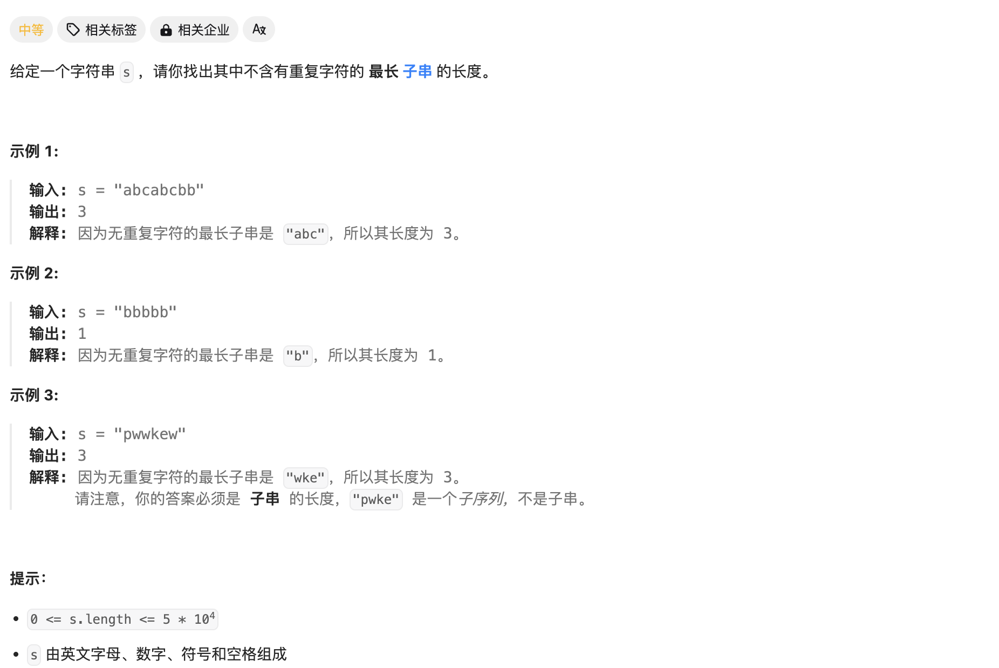

# [3. 无重复字符的最长子串](https://leetcode.cn/problems/longest-substring-without-repeating-characters/)



简答的滑动窗口问题，遍历窗口右端并使用集合`set`排查重复即可。


Code：

```c++
class Solution {
public:
    set<char> charSet;

    int lengthOfLongestSubstring(string s) {
        int n = s.size();
        if(!n) return 0;
        int l = 0;
        int ans=0;
        for(int r=0;r<n;r++){
            while(charSet.find(s[r])!=charSet.end()){
                //有重复元素
                charSet.erase(s[l]);
                l++;
            }
            ans = max(ans,r-l+1);
            charSet.insert(s[r]);
        }
        return ans;
    }
};
```

