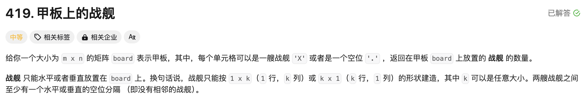
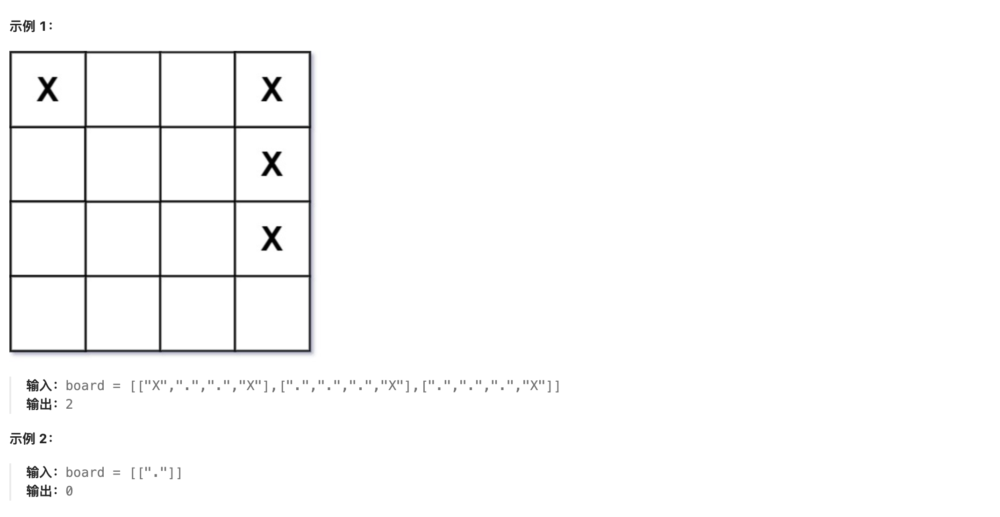
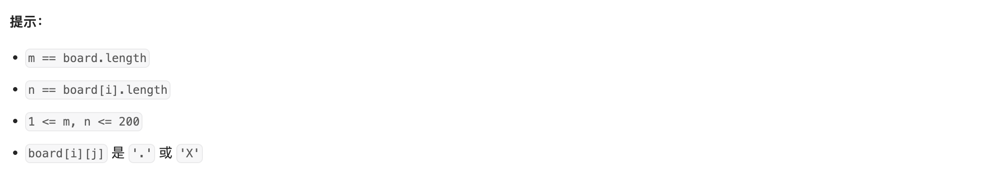

# [419. 甲板上的战舰](https://leetcode.cn/problems/battleships-in-a-board/)








如果想要在一趟遍历 + $O(1)$ 空间复杂度下计数，本人的想法是遇到一个军舰，就判断其右边和下面的格子是不是军舰，如果是就标记一下，下次不用重复计数了。

然而更简单的方法是，遍历到一个军舰，判断其左边和上面是不是军舰。


My Code：

```cpp
class Solution {
public:
    int countBattleships(vector<vector<char>>& board) {
        int res = 0;
        int m = board.size(), n = board[0].size();
        for(int row=0;row<m;row++){
            for(int col=0;col<n;col++){
                if(board[row][col]=='.'){
                    continue;
                }
                else if(board[row][col]=='*'){
                    // 连通位置
                    if(col+1!=n && board[row][col+1]!='.')
                        board[row][col+1] = '*';
                    else if(row+1!=m && board[row+1][col]!='.')
                        board[row+1][col] = '*';
                }
                else{
                    if(col+1!=n && board[row][col+1]!='.')
                        board[row][col+1] = '*';
                    else if(row+1!=m && board[row+1][col]!='.')
                        board[row+1][col] = '*';
                    res ++;
                }
            }
        }
        return res;
    }
};
```


Better Code （`Java`）：

```java
class Solution {
    public int countBattleships(char[][] board) {
        int m = board.length, n = board[0].length;
        int ans = 0;
        for (int i = 0; i < m; i++) {
            for (int j = 0; j < n; j++) {
                if (i > 0 && board[i - 1][j] == 'X') continue;
                if (j > 0 && board[i][j - 1] == 'X') continue;
                if (board[i][j] == 'X') ans++;
            }
        }
        return ans;
    }
}
```

