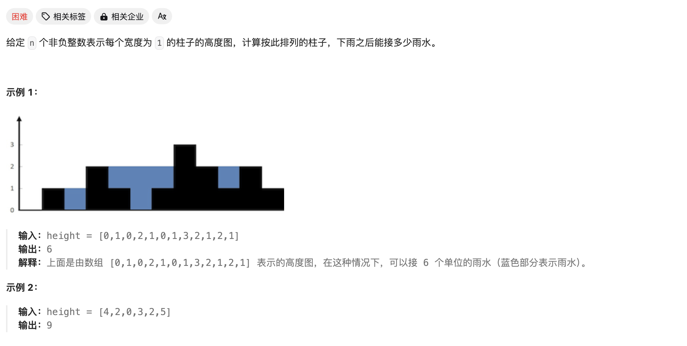
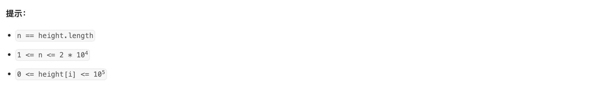
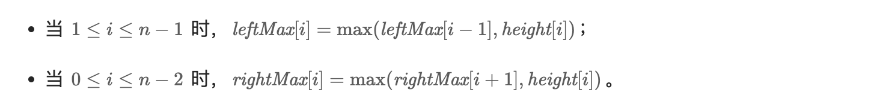

# [42. 接雨水](https://leetcode.cn/problems/trapping-rain-water/)






解题思路是对于每一个位置，求出左右两边的高度最大值，取两者的最小值就是此处可以达到的最高水量。

可以通过动态规划实现：



最后遍历一遍求得每个位置的水量即可。代码如下：

```c++
class Solution {
public:
    int leftMax[20005]; 
    int rightMax[20005];

    int trap(vector<int>& height) {
        int n = height.size();
        leftMax[0] = rightMax[0] = leftMax[n-1] = rightMax[n-1] = 0;
        //正向遍历
        for(int i=1;i<n;i++){
            leftMax[i] = max(leftMax[i-1],height[i-1]);
        }
        //反向遍历
        for(int i = n-2;i>=0;i--){
            rightMax[i] = max(rightMax[i+1],height[i+1]);
        }
        //计算
        int ans = 0;
        for(int i=0;i<n;i++){
            int tmp_add = min(leftMax[i],rightMax[i])-height[i];
            // cout<<i<<' '<<tmp_add<<endl;
            ans += (tmp_add>0)?tmp_add:0;
            // cout<<ans<<endl;
        }
        return ans;
    }
};
```

