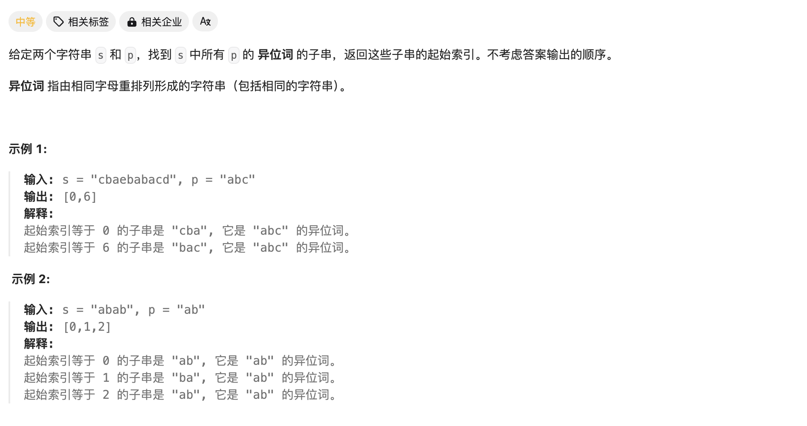
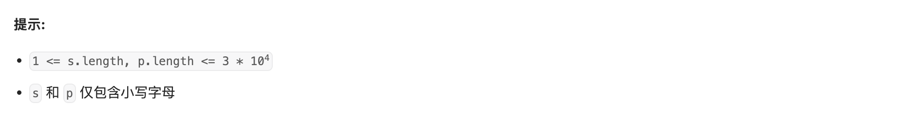

# [438. 找到字符串中所有字母异位词](https://leetcode.cn/problems/find-all-anagrams-in-a-string/)







简单的**滑动窗口**问题，由于 `p` 串长度是固定的，故滑动窗口的大小也是固定的。

直接遍历所有可能的窗口位置即可，使用两个数组记录每个字母的出现个数，所有字母个数相同即符合题目要求。

Code：

```c++
class Solution {
public:
    int char_s[27];
    int char_p[27];

    bool check(){
        for(int i=0;i<27;i++){
            if(char_p[i]!=char_s[i]) return false;
        }
        return true;
    }

    vector<int> findAnagrams(string s, string p) {
        //固定大小的滑动窗口实现遍历
        int len_s = s.size();
        int len_p = p.size();
        vector<int> ans;
        if(len_p>len_s) return ans;

        //统计p内字母个数
        for(int i=0;i<p.size();i++){
            char_p[p[i]-'a']++;
        }

        //开始滑动窗口
        for(int i=0;i<=len_s-len_p;i++){
            if(i==0){
                //重新录入
                for(int j=0;j<len_p;j++){
                    char_s[s[j]-'a']++;
                }
            }
            else{
                char_s[s[i-1]-'a']--;
                char_s[s[i+len_p-1]-'a']++;
            }

            if(check()) ans.push_back(i);

        }

        return ans;

    }
};
```