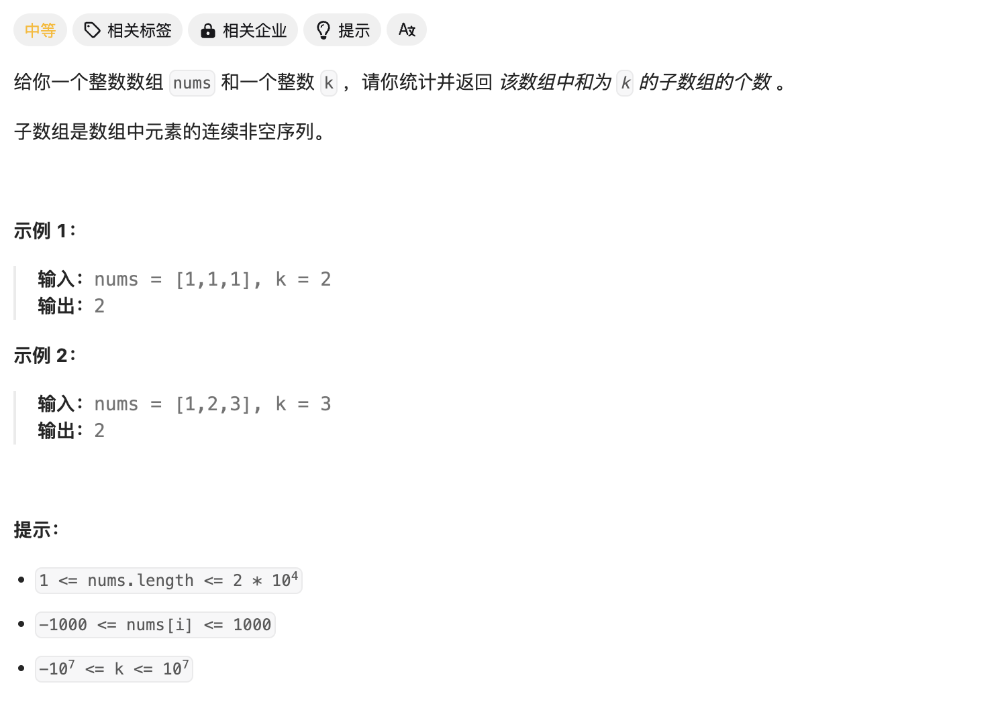

# [560. 和为 K 的子数组](https://leetcode.cn/problems/subarray-sum-equals-k/)



子串问题，由于求得是连续序列的和，很容易想到使用**前缀和**进行计算。接着爆搜遍历即可。

Code：

```c++
class Solution {
public:
    int preSum[20005];  //前缀和数组

    int subarraySum(vector<int>& nums, int k) {
        //求前缀和
        int n = nums.size();
        for(int i=0;i<n;i++){
            preSum[i+1] = preSum[i]+nums[i];
        }

        //遍历所有可能的情况
        int ans = 0;
        for(int left = 0;left<n;left++){
            for(int right = left;right<n;right++){
                // cout<<preSum[right+1]<<' '<<preSum[left]<<endl;
                if(preSum[right+1]-preSum[left]==k && right+1!=left){
                    // cout<<right<<' '<<left<<"*"<<endl;
                    ans++;
                }
            }
        }

        return ans;

    }
};
```

