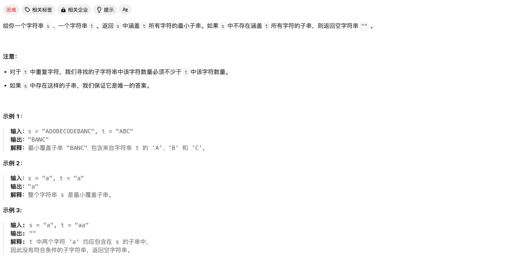
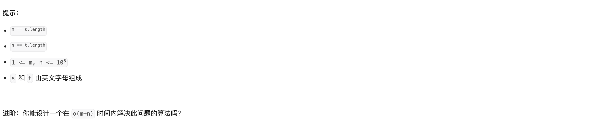

# [76. 最小覆盖子串](https://leetcode.cn/problems/minimum-window-substring/)






简单的滑动窗口问题，初始化窗口在最左侧，当不满足子串要求时**右节点不断右移**，直到满足要求后，开始**右移左节点**以寻找“最短”满足要求的子串。

使用哈希表 `unordered_map` 减小查找的时间复杂度。

基础知识：

>  `map` 的遍历：
>
> ```c++
> for(auto it = map.begin();it!=map.end();it++){
> 	cout<<*it<<endl;
> }
> ```
>
> `map` 下标查找：
>
> ```c++
> map.count(key)    // 结果为 1 / 0
> map.find(key)			// 结果为 map.end() / pos
> ```


Code：

```c++
class Solution {
public:
    unordered_map<char,int> mp_s;
    unordered_map<char,int> mp_t;
    // unordered_set<int> set_t;  

    //judge
    bool judge(){
        for(auto it=mp_t.begin();it!=mp_t.end();it++){
            if(mp_s.count((*it).first) && mp_s[(*it).first]>=(*it).second){
                continue;
            }
            else return false;
        }
        return true;
    }

    string minWindow(string s, string t) {
        //录入数据
        for(auto i:t){
            mp_t[i]++;
        }
        
        int ans = 2147483647;
        int s_l=0,s_r=0;
        bool flag = false;

        //滑动窗口遍历 s
        int l=0,r=0;
        for(r;r<s.size();r++){
            mp_s[s[r]]++;
            while(true){
                if(judge()){
                    flag = true;
                    // cout<<l<<' '<<r<<endl;
                    if(ans>r-l+1){
                        ans = r-l+1;
                        s_l = l;
                        s_r = r;
                    }
                    // ans = min(ans,r-l+1);
                    mp_s[s[l]]--;
                    l++;
                }
                else break;
            }
        }

        // cout<<"*** "<<s_l<<' '<<s_r<<endl;
        if(!flag) return "";

        string res = "";
        for(int i=s_l;i<=s_r;i++){
            res += s[i];
        }

        return res;

    }
};
```


